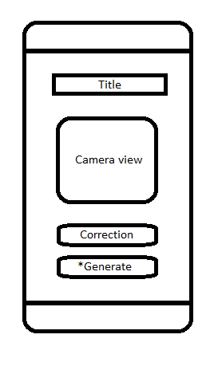

# Sudokinator

## App Description

„Sudokinator“ ist eine mobile Applikation, die Nutzern ermöglichen soll, Sudokus mühelos und effizient lösen zu lassen oder ihr bestehendes Ergebnis zu überprüfen und verifizieren. Die Eingabe des Sudoku-Felds erfolgt über die Kamera des Smartphones.

Die App soll hierfür eine noch nicht näher definierte OCR-Bibliothek verwenden. Diese Bibliothek scannt das Sudoku-Rätsel durch die Kamera des Geräts und wandelt die visuellen Informationen in digitale Daten um. Nachdem das Rätsels erfasst wurde, steht dem Nutzer die Option zur Verfügung, das Sudoku manuell zu korrigieren, falls es erforderlich ist.
Abschließend präsentiert die App entweder die Lösung des Rätsels, die mithilfe eines effizienten Backtracking-Algorithmus generiert wird, oder ob die Einträge des Nutzers korrekt sind. Der zugrunde liegende Algorithmus stützt sich in seiner Grundform auf die Brute-Force-Methode. Allerdings wird seine Leistungsfähigkeit durch die Analyse der Felder hinsichtlich der möglichen Zahlen in jedem Schritt verbessert, was zu einer gesteigerten Effizienz und somit zu einer beschleunigten Lösungsfindung führt.

Eine weitere denkbare Funktion könnte darin bestehen, dem Nutzer die Option zu bieten, entweder das gescannte Sudoku-Rätsel oder ein von der Anwendung erzeugtes Sudoku-Rätsel eigenständig zu lösen.

In Bezug auf das Design soll die App auf ein leichtgewichtiges Erscheinungsbild mit einer minimalen Farbpalette setzen, die dennoch ansprechend und modern ist. Damit wird die Benutzererfahrung verbessert und die App bleibt intuitiv.

## Functionality and design

1. The app should have a meaningful and self-explanatory greeting title, something like "Scan a Sudoku board".
2. The background should be a blurry white color and contain a square where you can see what the back camera sees. (something similar to Photomath)
3. Once the app is opened, the rear camera should be turned on automatically and show its view inside that square. Should a Sudoku board be scanned, the app automatically presents an overlay image of the solution.
4. There should be a button named "Correction" that upon pressing opens an overlay of the scanned Sudoku board and allows user input for the correction of the scanned numbers, should that happen.
5. (Extra feature) If time allows, there should be a second button that generates a Sudoku board and allows the user to solve it.

