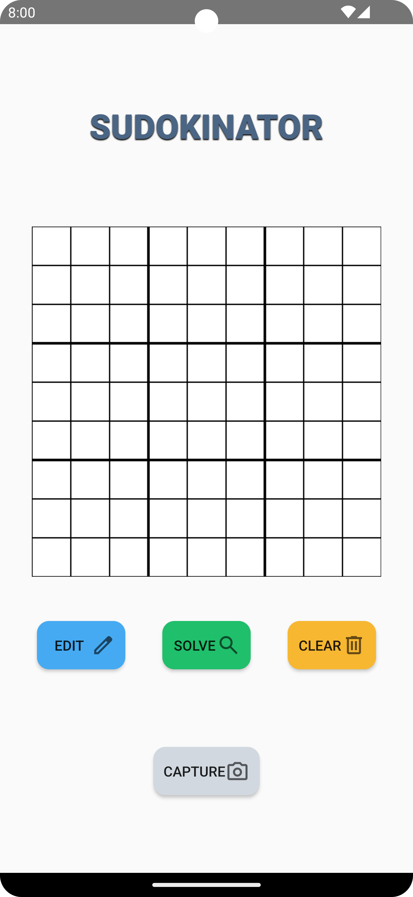

# Sudokinator

## App Description

„Sudokinator“ ist eine mobile Applikation, die Nutzern ermöglichen soll, Sudokus mühelos und effizient lösen zu lassen oder ihr bestehendes Ergebnis zu überprüfen und verifizieren. Die Eingabe des Sudoku-Felds erfolgt über die Kamera des Smartphones.

Die App soll hierfür eine noch nicht näher definierte OCR-Bibliothek verwenden. Diese Bibliothek scannt das Sudoku-Rätsel durch die Kamera des Geräts und wandelt die visuellen Informationen in digitale Daten um. Nachdem das Rätsels erfasst wurde, steht dem Nutzer die Option zur Verfügung, das Sudoku manuell zu korrigieren, falls es erforderlich ist.
Abschließend präsentiert die App entweder die Lösung des Rätsels, die mithilfe eines effizienten Backtracking-Algorithmus generiert wird, oder ob die Einträge des Nutzers korrekt sind. Der zugrunde liegende Algorithmus stützt sich in seiner Grundform auf die Brute-Force-Methode. Allerdings wird seine Leistungsfähigkeit durch die Analyse der Felder hinsichtlich der möglichen Zahlen in jedem Schritt verbessert, was zu einer gesteigerten Effizienz und somit zu einer beschleunigten Lösungsfindung führt.

Eine weitere denkbare Funktion könnte darin bestehen, dem Nutzer die Option zu bieten, entweder das gescannte Sudoku-Rätsel oder ein von der Anwendung erzeugtes Sudoku-Rätsel eigenständig zu lösen.

In Bezug auf das Design soll die App auf ein leichtgewichtiges Erscheinungsbild mit einer minimalen Farbpalette setzen, die dennoch ansprechend und modern ist. Damit wird die Benutzererfahrung verbessert und die App bleibt intuitiv.

## Functionality

1. Press Capture to start capturing an image of a sudoku
2. Select the 1:1 image format in the camera menu
3. Take a picture of the sudoku board, try to fit it on the 1:1 screen
4. The scanned numbers should be added to the sudoku board
5. If needed, open the edit menu to add/delete false inputs
6. Solve the sudoku
7. You can clear the sudoku contents and try again with a new sudoku

**Note**: After the image cropper feature gets added, step 2 and 3 will be unnecessary as you can crop the image around the sudoku board directly after capture.

## Dependencies

1. Camera dependency: CameraX version 1.3.0-rc01
2. OCR service: MlKit text recognition version 16.0.0

    
    
    
    

